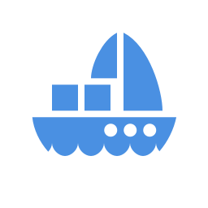

littleship
==========



A symfony app to manage your docker containers.

## Database

By default, LittleShip uses a SQLite database which will be stored in `app/data`
folder.

```shell
mkdir -p /data/http/app/data;
```

## Deploy assets

To install LittleShip you should have *Grunt* and *Bower* installed on your
server. Once you’ve setup symfony dependencies with composer, run:

```shell
npm install;
bower install -s;
app/console assets:install --symlink && grunt deploy;
```

## Using as a container

* Define a volume on `/var/run/docker.sock`
* Your PHP-FPM user must be in `docker` group with same GID as your host machine to access socket

## Nginx config

If your are using docker `maxexcloo/nginx-php` image, add this `nginx-symfony.conf`
file to your `/data/config` folder :

```nginx
rewrite ^/app\.php/?(.*)$ /$1 permanent;

location / {
    index app.php;
    try_files $uri @rewriteapp;
}

location @rewriteapp {
    rewrite ^(.*)$ /app.php/$1 last;
}

# pass the PHP scripts to FastCGI server from upstream phpfcgi
location ~ ^/(app|app_dev|config)\.php(/|$) {
    fastcgi_pass unix:/run/php5-fpm.sock;
    fastcgi_split_path_info ^(.+\.php)(/.*)$;
    include fastcgi_params;
    fastcgi_param  SCRIPT_FILENAME $document_root$fastcgi_script_name;
    fastcgi_param  HTTPS off;
}
```
